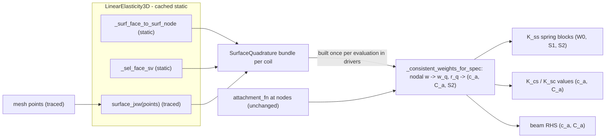

# Convert Beam Coupling to Consistent Surface Integrals (Springs at Quad Points)

Status: planned, not yet implemented.

Goal: replace the beam-side node-spring sums in `SupportBeams` with consistent
Galerkin surface integrals evaluated at face quadrature points (`w` interpolated
from nodal weights, moment arms at physical quad points, integrated with JxW),
so the beam coupling becomes the exact transpose-consistent counterpart of the
coil-side Winkler term while `Support` stays independent of `CoilFEM`.

## Background

The two sides of the coil-beam interface are currently discretized differently:

- The coil side is a proper Robin/Winkler surface integral
  `∫ k(x) (u − u_attach) · v dS` assembled with face shape functions and face
  quadrature (`LinearElasticity3D.set_params` folds `k_at_quad * ns_geom` into
  `nanson_scale`).
- The beam side (`K_ss` spring blocks, `K_cs`/`K_sc`, beam RHS) is a bare sum of
  discrete springs over surface nodes: `Σ_k w_k (…)` with no area measure. This
  makes the coupling stiffness scale with mesh resolution and leaves the
  documented units of `k_lin` (N/m²) inconsistent with `winkler_k` (N/m³) even
  though `CoilFEM` forces them equal.

## Physics summary

Every beam-side node sum `Σ_k w_k · g_k` becomes the consistent Galerkin surface
integral `∫_S w(x) g(x) dS`, discretized on the **same** exterior faces, face
shape functions, and quadrature the coil-side Winkler term already uses
(`src/coil_fem/problems/linear_elasticity.py` lines 711–719). Concretely, per
beam endpoint (beam `b`, symmetry transform `Q`, coupled coil `i`):

- Nodal weights `w_a` come from `attachment_fn` at surface **nodes** (unchanged —
  same field the coil side interpolates in `k_at_quad`), then are interpolated to
  face quad points: `w_q = Σ_a N_a(x_q) w_a`.
- Moment arms are taken at physical quad points: `r_q = (Q x)_q − x_ep` with
  `x_q = Σ_a N_a(x_q) x_a`.
- The measure is `JxW_q` (the Nanson `ns_geom` from `set_params`).

All beam-side blocks then reduce to three per-endpoint quantities
(`[·]×` = skew matrix):

- `c_a = ∫ w N_a dS` — consistent nodal weights, shape `(n_surf,)`
- `C_a = ∫ w N_a [r]× dS` — consistent nodal moment matrices, shape `(n_surf, 3, 3)`
- `S2 = ∫ w [r]× [r]× dS` — single `(3, 3)` (not expressible via `C_a`)

with, by partition of unity `Σ_a N_a = 1`:

- K_ss spring blocks: `W0 = Σ_a c_a`, `S1 = Σ_a C_a`, `S2` →
  `K_tt = k_lin W0 I`, `K_tr = −k_lin S1`, `K_rt = k_tor S1`, `K_rr = −k_tor S2`
  (same formulas as today, integral-valued).
- K_cs per node `a`: translation `−k_lin c_a Q⁻¹`, rotation `+k_lin Q⁻¹ C_a`.
- K_sc per node `a`: beam-translation row `−k_lin c_a Q`, beam-rotation row
  `−k_tor C_a Q`.
- Beam RHS: `f_t = k_lin Σ_a c_a (Q u_a)`, `f_r = k_tor Σ_a C_a (Q u_a)`.

This makes the coupling the exact transpose-consistent counterpart of `K_cc`'s
Winkler integral: exact rigid-body patch test, exact action–reaction, symmetric
coupled operator when `k_tor = k_lin`, and well-resolved torque integrals on
coarse surfaces. `k_lin` and `k_tor` become genuine foundation moduli in N/m³,
making the `winkler_k == k_lin` check in `src/coil_fem/coil_fem.py`
(lines 300–316) dimensionally sound.

Design invariants:

- **`w` stays nodal.** The beam side interpolates the same nodal weights the
  coil side interpolates (`k_at_quad`); do NOT re-evaluate `attachment_fn` at
  quad-point coordinates, or the two sides use different weight fields and the
  exact-consistency properties are lost.
- **`compute_weights` and `compute_attach` are unchanged.** The coil-side
  integral already handles areas via `nanson_scale`; the attach field
  `u_ep + θ×r` is linear in `x` and reproduced exactly by nodal interpolation.
- **Quadrature data is passed as plain arrays, not FEM objects**, so `Support`
  stays independent of `CoilFEM`/pipelines. `None` falls back to the current
  node-spring behavior.
- **Sparsity patterns are untouched**: `c_a`/`C_a` are defined for every surface
  node (zero away from the attachment), so `coupling_pattern`, `_coo_I/_coo_J`,
  merged CSR, and cuDSS handles are all unchanged.

## Data flow

## 1. `LinearElasticity3D` — `src/coil_fem/problems/linear_elasticity.py`

- **Factor out `_surface_ns_geom(points)`** from the surface-geometry block
  inlined in `set_params` (lines 668–697): face Jacobian →
  `ns_geom = |n·J⁻¹| · det(J) · face_qw`, shape `(num_sel, n_fq)`, traced through
  `points`, using the cached static face data (`boundary_inds_list[0]`,
  `_face_sg_ref`, `_face_qw`, `_face_normals`, `_cells_jnp`). `set_params` calls
  it; no behavior change. This is required because the clean `ns_geom` currently
  exists only transiently — what is stored (`nanson_scale`) is pre-multiplied by
  `k_at_quad` and unrecoverable where weights are zero.
- **Public `surface_jxw(points)`**: thin wrapper returning
  `_surface_ns_geom(points)` for the Winkler surface; raises a clear error when
  no Winkler surface is configured.
- **Expose static accessors** (properties): `surface_face_nodes` →
  `_surf_face_to_surf_node` `(num_sel, npf)` compact map, and
  `surface_face_shape_vals` → `_sel_face_sv` `(num_sel, n_fq, npf)`. Both already
  built and cached in `_build_winkler_surface_maps`; ordering matches
  `surface_node_global_indices` (= `pipeline.surface_node_indices`), so
  everything aligns element-wise with `surface_pts_by_coil`.

## 2. `SurfaceQuadrature` container — `src/coil_fem/coupling/supports.py`

- Small frozen dataclass (or NamedTuple) defined on the coupling side so
  `Support` never imports FEM code:
  - `face_nodes` : int array `(num_sel, npf)` — compact surface-node indices per
    face (static).
  - `face_sv` : float array `(num_sel, n_fq, npf)` — shape values at face quad
    points (static).
  - `jxw` : jax.Array `(num_sel, n_fq)` — area element × quad weight (traced).
- Document the convention in the `Support` docstring: `surface_quad_by_coil` is
  an optional list (one entry per coil, or `None`); `None` means legacy discrete
  node springs. A standalone user can build one from any surface triangulation —
  no `CoilFEM` needed.
- Add `surface_quad_by_coil=None` kwarg to the base `coupling_values` (ignored;
  returns empty as today) so drivers can pass it uniformly.

## 3. `ElasticPipeline` — `src/coil_fem/pipelines.py`

- `surface_quadrature(points) -> SurfaceQuadrature`: assembles the bundle from
  the problem's static accessors (cached, fetched once) plus
  `problem.surface_jxw(points)` (traced). Import of `SurfaceQuadrature` from
  `coupling.supports` is acyclic (`coupling` does not import `pipelines` at
  runtime).

## 4. `SupportBeams` — `src/coil_fem/coupling/beam_network.py`

- **New helper
  `_consistent_weights_for_spec(spec, surf_pts, squad, support_dofs) -> (c, C, S2)`**,
  fully vectorized (no per-node Python loops):
  1. Nodal weights via the existing `_clamp_weights_for_spec` (line 796,
     unchanged) → `w_a`, and transformed nodal positions `xT = Q·surf_pts`
     (already computed there as `surf_tfm`).
  2. Gather to faces: `w_face = w_a[face_nodes]`, `xT_face = xT[face_nodes]`.
  3. Interpolate: `w_q = einsum('sqn,sn->sq', face_sv, w_face)`;
     `x_q = einsum('sqn,snd->sqd', face_sv, xT_face)`; `r_q = x_q − x_ep`;
     `skews = skew(r_q)` `(s, q, 3, 3)`.
  4. Integrate + scatter:
     - `c = zeros(n_surf).at[face_nodes].add(einsum('sq,sqn->sn', w_q*jxw, face_sv))`
     - `C = zeros((n_surf,3,3)).at[face_nodes].add(einsum('sq,sqn,sqij->snij', w_q*jxw, face_sv, skews))`
     - `S2 = einsum('sq,sqij->ij', w_q*jxw, skews @ skews)`
- **`_endpoint_weights_and_r(..., surface_quad_by_coil=None)`** (line 1596):
  when a bundle is given, coil-side endpoint dicts carry
  `{'c', 'C', 'S2', 'node_side', 'coil', 'tfm'}`; when `None`, keep the legacy
  `{'w', 'r'}` entries (backward compat for standalone use). Foundation entries:
  `'w': self._beam_options.get('a_foundation', 1.0)` — new optional key
  documenting the foundation pad area [m²], default 1.0 (keeps the ground
  point-spring dimensionally consistent with the N/m³ `k_lin`).
- **`_spring_stiffness_contributions`** (line 1660): branch per entry type —
  consistent (`W0 = sum(c)`, `S1 = sum(C, axis=0)`, `S2` direct), legacy nodal
  (current code path), foundation (current code path). Block formulas unchanged.
- **`coupling_values(..., surface_quad_by_coil=None)`** (line 1454): per spec,
  use `(c_a, C_a)`; value blocks become
  `blk_t_cs = −k_lin c[:,None,None] Qinv`, `blk_r_cs = k_lin Qinv @ C`,
  `blk_t_sc = −k_lin c[:,None,None] Q`, `blk_r_sc = −k_tor C @ Q`. Entry order
  identical to `coupling_pattern` — no pattern change.
- **`coupling_terms(...)`** (line 1520): accept and forward the bundle.
- **`coo(..., surface_quad_by_coil=None)`** (line 1786): forward to
  `_endpoint_weights_and_r`.
- **`_assemble_rhs`** (line 1854): for consistent entries,
  `f_t = k_lin einsum('n,nd->d', c, u_mesh @ Q.T)` and
  `f_r = k_tor einsum('nij,nj->i', C, u_mesh @ Q.T)`; legacy path unchanged.
- **`solve(inputs)`** (line 1914): read `inputs.get('surface_quad_by_coil')`
  (default `None`), forward to `coo` and `_endpoint_weights_and_r`.
- **Explicitly unchanged**: `compute_weights` (coil-side dimensionless nodal
  weights — the coil integral applies its own measure) and `compute_attach`
  (nodal rigid-body field, normalized average; the coil side interpolates it and
  linear fields are reproduced exactly). Add a short comment in each stating why
  quadrature must NOT be applied there. Known residual approximation to
  document: where multiple beams overlap on the same nodes, the staggered
  attach-average and the monolithic blocks differ at interpolation order —
  inherent to the shifted-Winkler staggered form, exists today, no action.
- Update the class docstring: `k_lin`, `k_tor` [N/m³]; spring laws
  `F = k_lin ∫ w (u_att − u_mesh) dS`, `τ = k_tor ∫ w r × (u_att − u_mesh) dS`;
  describe the `(c, C, S2)` reduction and the nodal-`w`-interpolation convention.

## 5. Drivers — `src/coil_fem/coupling/drivers.py`

Drivers own the pipelines, so they build the bundles — `Support` never sees a
pipeline and `CoilFEM._solve_all` needs no new plumbing:

- **`solve_staggered`**: after `surface_pts_by_coil` (line 212), build once per
  evaluation:
  `surface_quad_by_coil = [pipelines[i].surface_quadrature(mesh_points_by_coil[i]) for i in range(n_pipelines)]`
  and add `'surface_quad_by_coil'` to `support_inputs` in `_sweep` and
  `_sweep_full`. As a closure constant it is reused across all BG-S iterations
  and by the IFT adjoint's `jax.vjp(_sweep, ...)`.
- **`make_merged_solve`**: capture the static parts (`face_nodes`, `face_sv`)
  per coil at closure-build time; add a `_surf_quad(pts)` helper next to
  `_surf_pts` (line 481) that computes the traced `jxw` from `pts` and assembles
  bundles. Use it in `_assemble_merged_values` (pass to `support.coo` and
  `support.coupling_values`) and inside `_bwd`'s `_merged_constraint` from
  `pts_in`, so the adjoint captures `d(jxw)/d(points)`.

## 6. `CoilFEM` — `src/coil_fem/coil_fem.py`

Structurally untouched:

- `_solve_all`, `_compute_support_weights`: **no changes** (weights stay
  nodal/dimensionless; drivers build bundles).
- `build_monolithic_static`: **no changes** — `coupling_pattern` I/J, K_ss
  `_coo_I/_coo_J`, merged CSR patterns, cuDSS handles all unaffected (only
  traced V values change).
- Update the comment/docstring at the `winkler_k == k_lin` check
  (lines 300–316): both are foundation moduli in N/m³ and the coupling blocks
  are now the consistent counterparts of the Winkler integral. Keep the check.

## Cached/static information reuse

- Face→node map, face shape values, compact node ordering: built once in
  `custom_init`/`_build_winkler_surface_maps`, exposed read-only, never rebuilt.
- `jxw`: the only traced piece; computed once per coil per objective evaluation
  in the drivers, reused across all beams/endpoints/specs and all staggered
  iterations.
- Per-spec `(c, C, S2)`: computed once per assembly pass inside
  `_endpoint_weights_and_r` / `coupling_values` (same call pattern as today's
  `_clamp_weights_for_spec`).
- COO/CSR sparsity, cuDSS solver handles, `coupling_pattern`, K_ss static I/J:
  all unchanged.

## Behavior changes and test plan

Numerical results **change by design** (coupling stiffness rescaled by
attachment area, typically ≪ 1 m²); users likely need to rescale
`k_lin`/`k_tor`. The legacy `None` path is bit-identical to today.

- New `tests/test_surface_quadrature.py`:
  - Area sanity: per-spec `Σ_a c_a` with `w ≡ 1` equals the analytic lateral
    surface area of a swept-rectangle coil; matches `Σ jxw`.
  - **Patch test**: rigid translation of coil surface + beam endpoint together
    gives machine-zero net spring force/torque (rows of K_cs against the Winkler
    K_cc contribution, and beam RHS vs K_ss action).
  - **Transpose symmetry**: with `k_tor = k_lin` and `Q = I`, assembled
    `K_cs == K_scᵀ` block-for-block.
  - Refinement convergence: coupled staggered solve converges under surface
    refinement (vs the old node-spring growth).
  - Gradient check: `jax.grad` through `surface_jxw(points)` and through a small
    coupled solve vs finite differences.
  - Legacy fallback: `surface_quad_by_coil=None` reproduces current outputs.
- Update `tests/test_beam_networks.py`, `tests/test_drivers.py`,
  `tests/test_monolithic.py`: expectations that go through the drivers now use
  consistent integrals; add one staggered-vs-monolithic consistency case with
  quadrature enabled.
- Docs: AGENTS.md Support table (`coupling_values`/`coo`/`solve` signatures,
  `SurfaceQuadrature`), `docs/theory` note on the consistent coupling,
  `a_foundation`.

## Decisions taken

- Beam-side `w` at quad points is **interpolated from the nodal weights**
  (matching `k_at_quad` exactly), not re-evaluated via `attachment_fn` at quad
  coordinates — preserves exact patch-test/transpose consistency with the coil
  side.
- Bundles built in the **drivers** (which own pipelines), not in
  `CoilFEM._solve_all`.
- `None` bundle falls back to the current discrete node springs (backward
  compatible; standalone `Support` use stays FEM-free).
- Foundation spring stays a discrete point spring with optional
  `beam_options['a_foundation']` (default 1.0).
- `compute_weights`/`compute_attach` stay nodal and unchanged.

## Implementation checklist

- [ ] `LinearElasticity3D`: factor `_surface_ns_geom(points)` out of
      `set_params`; add `surface_jxw(points)` and static
      `surface_face_nodes` / `surface_face_shape_vals` accessors
- [ ] `coupling/supports.py`: add `SurfaceQuadrature` container; document the
      convention; add `surface_quad_by_coil` kwarg to base `coupling_values`
- [ ] `ElasticPipeline`: add `surface_quadrature(points)` bundle builder
- [ ] `SupportBeams`: add `_consistent_weights_for_spec`; rework
      `_endpoint_weights_and_r`, `_spring_stiffness_contributions`,
      `coupling_values`, `coupling_terms`, `coo`, `solve`, `_assemble_rhs`;
      add `a_foundation` option
- [ ] Drivers: build `surface_quad_by_coil` once in `solve_staggered`; traced
      `jxw` inside `make_merged_solve` forward and adjoint constraint
- [ ] `CoilFEM`: update `winkler_k == k_lin` comment/docstrings; verify
      `build_monolithic_static` unchanged
- [ ] Tests: add `tests/test_surface_quadrature.py`; update beam/driver/
      monolithic tests
- [ ] Docs: update AGENTS.md and docstrings (units N/m³, integral spring laws)
