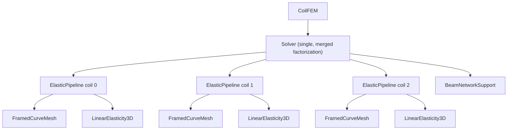
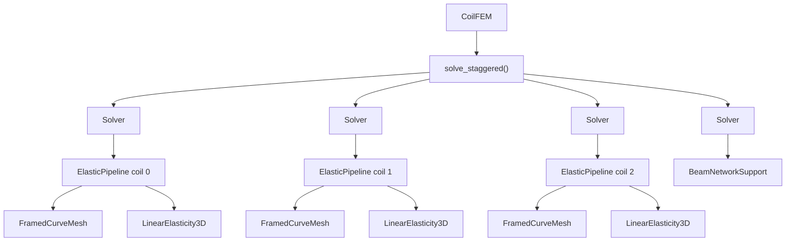

> **Historical note:** This document predates the clamp/attachment moduli split (`k_clamp` / `k_attachment` on `Support`, `params['support_k']`, VTU fields `w_clamp`/`w_attach`/`k_clamp_Npm3`/`k_attach_Npm3`).  API names such as `winkler_k`, `support_weights`, `support_attach`, and `compute_attach` are obsolete.  Prefer `AGENTS.md` and `docs/developers/support_structure.rst` for current behaviour.

# Architecture Evaluation: Spatial Materials, ThermoElasticity, and Support-Structure Coupling

Evaluation of the architectural changes needed for four requested capabilities,
and a single proposed architecture that covers all of them:

1. Spatially dependent material properties (per-quad fields).
2. A `ThermoElasticity` problem solving the coupled heat-conduction +
   thermo-elastic system of the
   [jax-fem thermal-mechanical example](https://deepmodeling.github.io/jax-fem/learn/thermal_mechanical_control/example.html#Governing-equations).
3. `CoilFEM` compatibility with `ThermoElasticity`.
4. Future support-structure models (Plans A and B of `SUPPORT_PLANS.md`),
   including beam-network and FEM supports, and eventual nonlinear coil
   problems.

**Headline answer:** remarkably little *architectural* change is required,
because one design principle answers all four questions at once:

> **Everything is a composition of independently differentiable solve-blocks
> that communicate through per-quadrature-point field arrays.**

- Q1 is pure plumbing (per-quad `internal_vars`), no architecture change.
- Q2 falls out of Q1 plus one new ~200-line `HeatConduction3D` problem class,
  because the thermo-mechanical coupling is **one-way** (T → u): composition
  of two symmetric solves is *exact*, no monolithic 2-variable problem needed.
- Q3 requires factoring `CoilFEM`'s per-coil solve into a small "physics
  pipeline" object; the public API survives unchanged.
- Q4's Plan A staggered coupling is the *same composition pattern* with a
  fixed-point iteration around it; the ThermoElasticity composition is its
  degenerate (one-sweep, exact) special case. One new orchestration layer
  (the `Support` ABC + `solve_staggered`/`solve_monolithic` coupling
  functions) covers beam networks, support FEM, and future nonlinear coils
  without touching the problem classes.

---

## 0. Load-bearing facts about the current code

These determine everything below; each was verified against the installed
`jax_fem` and the current `coil_fem` source.

1. **JAX-FEM internal vars are already per-quad fields.**
   `split_and_compute_cell` vmaps every kernel over cells and passes
   `*internal_vars` positionally; each entry has leading shape
   `(num_cells, num_quads, ...)` and arrives per-point inside
   `tensor_map` / `mass_map`. `LinearElasticity3D` already uses this for
   `body_force`. Spatially varying λ, μ, ε_th are *the same mechanism with
   more entries* — zero framework change.

2. **JAX-FEM `Problem` is natively multi-variable** (`fes` list, DOF
   `offset`, concatenated `shape_grads`, `JxW` shaped
   `(num_cells, num_vars, num_quads)`), and `ad_wrapper` / the solution-list
   convention are variable-count agnostic. A monolithic `[u, T]` problem is
   *possible* today.

3. **But the thermo-mechanical Jacobian is asymmetric** (one-way coupling
   gives block-triangular `[[K_uu, K_uT], [0, K_TT]]`). The CPU adjoint is
   fine (`jax_fem.solver.implicit_vjp` solves `A.transpose()`), but
   `cudss_ad_wrapper.adjoint_solve` explicitly assumes `Aᵀ = A` and reuses the
   symmetric factorization. A monolithic ThermoElasticity on the GPU path
   would need `mtype_id=0` (general LU) **plus a transpose-solve phase that
   spineax does not currently expose** — the same missing spineax feature
   flagged in `SUPPORT_PLANS.md`.

4. **The stock surface kernel only touches variable 0**
   (`get_surface_kernel` reads `cell_sol_list[0]`, `nanson_scale[0]`). The
   Winkler trick (identity surface map, k folded into `nanson_scale`) works in
   a multi-var problem only if `u` is variable 0, and a thermal surface BC
   (Robin/convection) in the *same* monolithic problem would force a custom
   `get_universal_kernels_surface`. In separate single-variable problems, both
   BCs get the existing simple machinery for free.

5. **`set_params` geometry recompute is single-variable-shaped** —
   `self.JxW = jxw[:, None, :]` hard-codes `num_vars=1`. Generalizing to
   multi-var is mechanical (tile over vars sharing the mesh) but touches the
   most delicate differentiable-geometry code in the repo.

6. **The cuDSS wrapper is otherwise physics-agnostic**: it consumes flat
   DOFs, `problem.I/J/V_jax`, and BC metadata looping over all `fes`. Any
   `DeviceProblem` with symmetric tangent works unmodified.

7. **`FramedCurveMesh` already owns the reference-coordinate fields**
   (`phi_quad`, `uv_quad`, populated by `attach_ref_coords`) that a spatial
   material parametrization naturally wants.

---

## 1. Spatially dependent material properties

**Verdict: small change, no new architecture. ~1 day.**

### Mechanism

Promote λ, μ (and the thermal eigenstrain) from Python floats closed over in
`get_tensor_map` to per-quad internal variables:

```python
# LinearElasticity3D.set_params
self.internal_vars = [params['body_force'],      # (n_cells, n_quads, 3)
                      params['lam_q'],           # (n_cells, n_quads)
                      params['mu_q'],            # (n_cells, n_quads)
                      params['eps_th_q']]        # (n_cells, n_quads, 3, 3)

# get_tensor_map
def stress(u_grad, bf, lam, mu, eps_th):         # all per-point now
    eps_m = 0.5 * (u_grad + u_grad.T) - eps_th
    return lam * jnp.trace(eps_m) * jnp.eye(3) + 2.0 * mu * eps_m
```

Internal vars are passed positionally to *every* kernel, so `mass_map` grows
matching ignored arguments — a documented ordering convention, nothing more.
Uniform materials become the broadcast special case (`jnp.full`), so a single
code path serves both; the memory cost of `(n_cells, n_quads)` scalars is
negligible next to `shape_grads`.

### Where the field lives — `FramedCurveMesh` vs the pipeline

The **core Q1 change** is making constitutive kernels and `set_params` accept
per-quad `(n_cells, n_quads)` arrays; uniform material is the broadcast
special case (`jnp.full`). That ships without any new user-facing API.

**Optional sugar** for spatially varying *optimizable* materials: a callable
evaluated per forward pass, mirroring the existing `fixed_clamp_fn` pattern:

```python
material_fn(x_quad, phi_quad, uv_quad, dofs) -> {'lam': ..., 'mu': ..., 'eps_th': ...}
```

Use this only when material parameters are DOFs. Reasons: (a) the field must be
re-evaluated inside the JAX trace whenever geometry or material DOFs change; (b)
`FramedCurveMesh` already exposes everything the callable needs (`phi_quad`, `uv_quad`,
physical quad points via `recompute_fe_geometry`). For static spatial fields,
pass pre-built per-quad arrays directly — no callable needed. A convenience
`FramedCurveMesh.eval_field(fn)` for forward-only diagnostics is fine.

### Ripple effects

- `metrics.py`: `cauchy_stress_small_strain` mostly broadcasts already —
  `lam * tr[..., None, None]` and a per-quad `eps_th` of shape
  `(n_cells, n_quads, 3, 3)` work unchanged, but `2.0 * mu * eps_m` needs
  `mu[..., None, None]` when `mu` is a `(n_cells, n_quads)` field. A one-line
  normalization at the top of the function (`lam, mu = jnp.atleast_1d(...)`
  reshaped to `(..., 1, 1)`) makes every metric accept "float or per-quad
  array" with no other changes.
- `CoilFEM`: `_forward_solve` gains per-quad `lam_q`/`mu_q`/`eps_th_q` params;
  `material_options` may *optionally* accept a `material_fn` callable to build
  those arrays. `self._lam/self._mu` scalars become the per-coil broadcast
  arrays handed to metrics.
- Post-processing (`von_mises_stress`, `strain_tensors`,
  `compute_strain_tensors`) switch from `self.lam/self.mu` scalars to the
  stored per-quad arrays; `eps_thermal` output becomes per-quad instead of a
  single `(3, 3)`.

---

## 2. `ThermoElasticity`

The target system (jax-fem example, adapted to 3D coils):

```
-∇·(k ∇T)  = q̇          + T Dirichlet/Neumann/Robin BCs      (heat)
-∇·σ       = f_lorentz    + Winkler BCs                        (mechanics)
 σ = λ tr(ε) I + 2μ ε − κ (T − T_ref) I                        (one-way coupling)
```

Temperature influences deformation; deformation does not affect temperature.
This one-way structure is the pivotal architectural fact.

### Two candidate designs

**Design M — monolithic 2-variable problem** (a literal port of the jax-fem
example): `ThermoMechanical3D(DeviceProblem)` with `[mesh, mesh]`,
`vec=[3, 1]`, a `get_universal_kernel` computing both weak-form terms, one
solve for `[u, T]`.

**Design C — composition of two single-variable problems** *(recommended)*:

```python
# per coil, inside one traced expression — plain function composition:
T_sol   = fwd_pred_T({'points': pts, 'heat_source': q, 'k_q': k, ...})    # HeatConduction3D
T_quad  = interp_T_at_quads(T_sol, shape_vals)                            # einsum, differentiable
eps_th  = eigenstrain_from_T(T_quad)          # −κ(T−T_ref)·I  or itc-table lookup
u_sol   = fwd_pred_u({'points': pts, 'body_force': f, 'eps_th_q': eps_th, ...})
```

Because the coupling is one-way, **composition is exact — no interface
iteration** — and `jax.grad` chains the two `custom_vjp`s automatically. Each
solve keeps a *symmetric* matrix.

| | Design M (monolithic) | Design C (composed) |
|---|---|---|
| Matrix symmetry | **Asymmetric** (block-triangular) | Both symmetric |
| cuDSS path | Needs `mtype=0` + transpose solve (missing spineax feature) or an extra Aᵀ factorization | **Works today, unchanged** |
| CPU path | Works (`implicit_vjp` transposes) | Works |
| Factorization cost | One larger (4·N_nodes DOFs, superlinear) | 3·N + 1·N separately (**cheaper**, per `SUPPORT_PLANS` cost model) |
| `set_params` geometry | Must generalize multi-var `JxW`/`shape_grads` tiling (delicate) | Reuses single-var `set_params` verbatim |
| Winkler + thermal surface BCs | Var-0 limitation forces universal surface kernels | Each problem keeps stock surface machinery |
| New code | ~400 lines incl. universal kernel, multi-var set_params | ~200-line `HeatConduction3D` + ~50-line composition |
| Relation to Q4 | None | **Is the Plan A pattern** (staggered, degenerate one-sweep case) |

**Recommendation: Design C.** It is smaller, faster, GPU-compatible today,
and — decisively — it is the same composition-of-differentiable-blocks
pattern the support coupling needs, so building it builds Plan A's skeleton.
Design M remains available later as a validation cross-check if desired, but
should not be the primary path.

### What `HeatConduction3D` looks like

A ~200-line sibling of `LinearElasticity3D` (scalar field, `vec=1`), reusing
its patterns nearly one-for-one:

- `get_tensor_map`: `flux(T_grad, k, ...) = k * T_grad` with per-quad `k`
  (Q1 machinery).
- `get_mass_map`: heat source `−q̇` (e.g. nuclear heating), per-quad internal
  var, exactly like `body_force`.
- `set_params`: **identical** differentiable geometry recompute
  (`recompute_fe_geometry` is already field-agnostic).
- Dirichlet T: existing `dirichlet_bc` helper / `fe.vals_list` machinery
  (this is also what makes the jax-fem example's control parameter — boundary
  temperature — differentiable if wanted later).
- Robin/convection BC `∫ h (T − T_env) dS`: **the Winkler trick verbatim** —
  identity-like surface map with `h` folded into `nanson_scale`, per-node
  weights interpolated by `_sel_face_sv`. The exterior-face detection and
  surface-map builder in `LinearElasticity3D.custom_init` should be extracted
  into a shared mixin/helper (it is already written generically over
  `self.fes`) rather than duplicated.

### `itc` compatibility

The current uniform `itc` eigenstrain becomes the trivial case of the per-quad
`eps_th_q` field (Q1): no temperature solve, `eps_th_q = −itc·I` broadcast.
`ThermoElasticity` replaces the constant with the field computed from `T`.
One code path, three regimes: isothermal, uniform-itc, full thermo-elastic.

---

## 3. Making `CoilFEM` compatible

**Verdict: a contained internal refactor; public API preserved. ~2–3 days.**

What is hard-coded today: `LinearElasticity3D` construction in `__init__`,
the `{'points', 'body_force', 'support_weights'}` params dict in
`_forward_solve`, scalar `(lam, mu)` threaded to metrics, and `run()`'s
elasticity-specific output keys.

### Proposed factoring

Extract the per-coil solve into a **physics pipeline** object; `CoilFEM`
remains the user-facing facade and selects the pipeline from options:

```python
class ElasticPipeline:
    """Owns problems + fwd_preds for ONE coil; built once at CoilFEM.__init__."""
    def __init__(self, mesh, material_opts, problem_opts): ...
    def solve(self, pts, loads: dict, fields: dict) -> dict:
        # returns {'u': ..., 'shape_grads': ..., 'fields': {...}}

class ThermoElasticPipeline(ElasticPipeline):
    # adds HeatConduction3D + composition; returns {'u': ..., 'T': ...}
```

`CoilFEM.objective` / `run` change only in the inner loop: build loads and
material fields (as today), call `pipeline.solve`, hand the returned `state`
dict to metrics (each metric indexes the fields it needs — today only `'u'`).
Selection stays declarative:

```python
CoilFEM(..., physics_options={'type': 'thermoelastic',
                              'k': ..., 'T_ref': ..., 'heat_source': ...})
```

This keeps `CoilFEM` from becoming a class hierarchy: **one facade, pluggable
pipelines**, and it is precisely the seam where the support driver (Q4) will
plug in.

### Per-coil state ownership

The pipeline is the natural home for *all* per-coil state, eliminating the
parallel `n_base`-length lists `CoilFEM` currently indexes by `coil_idx`
(`self.meshes`, `self._problems`, `self._fwd_preds`,
`self._surface_node_indices`). In particular the coil's `FramedCurveMesh` becomes a
**pipeline attribute**, not a `CoilFEM` list, for two reasons:

- The `LinearElasticity3D` is *built from* the mesh and cross-linked via
  `mesh.attach_ref_coords(prob)`; splitting them across objects couples two
  containers for no benefit.
- One mesh is shared by *all* `Problem`s of a coil — decisively so for
  `ThermoElasticPipeline`, whose `HeatConduction3D` and `LinearElasticity3D`
  discretize the same coil on the same mesh. "One mesh per pipeline, several
  Problems on it" is the correct ownership shape.

Ownership boundary:

- **`CoilFEM` builds** the mesh (`FramedCurveMesh.from_options(fc, opt, mesh_type)`,
  which needs facade-level inputs: the framed curve and `mesh_options`) and
  hands the built mesh to the pipeline constructor. Mesh *construction* stays
  out of the pipeline so `FramedCurveMesh` remains standalone and physics-agnostic.
- **The pipeline holds** the mesh as the single source of truth and exposes it
  (plus `mesh_points_from_dofs`, `surface_node_indices`) for read.
- **`CoilFEM` reads** `pipeline.mesh` where its cross-coil physics needs coil
  geometry. The Lorentz body-force assembly (`_body_force_at_quads`) stays in
  `CoilFEM` — it needs *all* coils' geometry/currents (Biot-Savart external
  field, symmetry expansion), so it is inherently a facade-level concern that
  queries each `pipeline.mesh` read-only for the target coil's quad points.

### Backend-agnostic solver construction (helper, not a new class)

The CPU and cuDSS paths already return call-compatible closures
(`fwd_pred(params) -> sol_list`), which is why `_forward_solve` is already
backend-agnostic. The only branching is at *construction*
([src/coil_fem/coil_fem.py](../src/coil_fem/coil_fem.py):403-469): the
`_use_cudss` switch for the `gpu_assembly` flag, the solver-option dicts, and
`cudss_ad_wrapper` vs `ad_wrapper`. No unifying `Solver` abstraction is needed
— two small helpers (natural home: `coil_fem/solvers/__init__.py`) collapse the
branch to one uniform call site:

```python
def needs_gpu_assembly(problem_options) -> bool:
    return problem_options.get('solver') == 'cudss'

def build_fwd_pred(problem, problem_options):
    name = problem_options.get('solver', 'umfpack')
    if name == 'cudss':
        from .cudss import cudss_ad_wrapper
        return cudss_ad_wrapper(
            problem,
            device_id=int(problem_options.get('cudss_device_id', 0)),
            mtype_id=int(problem_options.get('cudss_mtype_id', 1)),
            tol=float(problem_options.get('cudss_tol', 1e-6)),
            rel_tol=float(problem_options.get('cudss_rel_tol', 1e-8)),
            max_iter=int(problem_options.get('cudss_max_iter', 50)),
        )
    adj = problem_options.get('adjoint_solver', 'umfpack')
    return ad_wrapper(
        problem,
        solver_options={f"{name}_solver": {}},
        adjoint_solver_options={f"{adj}_solver": {}},
    )
```

The pipeline constructor then builds problem + `fwd_pred` with no branch:

```python
prob = LinearElasticity3D(..., gpu_assembly=needs_gpu_assembly(problem_options))
mesh.attach_ref_coords(prob)
fwd = build_fwd_pred(prob, problem_options)
```

`gpu_assembly` stays a separate call because it is a `Problem` constructor
argument decided before the wrapper exists. The `Solver` label used in the
diagrams below is therefore conceptual: on GPU it is a `CuDSSNewtonSolver`
closed over by `cudss_ad_wrapper`; on CPU it is an unnamed `ad_wrapper`
closure — no class by that name exists or needs to.

---

## 4. Support structures A and B

### 4a. How much code do Plans A and B share?

Roughly **70–80 %**. Itemized (extending `SUPPORT_PLANS.md` §"Development
steps"):

| Component | A | B | Shared? |
|---|---|---|---|
| Nonzero attachment term (`surface_map(u, x, u_attach) = u − u_attach`, `support_attach` via `_sel_face_sv` into `internal_vars_surfaces`) — the A-side of the coupling | ✓ | ✓ | **Yes** (~15–30 lines) |
| B-side coupling: `Support.displacement_at` (forward `C_AB`) + load-scatter inside `Support.solve` (transpose `C_BA`) — no separate transfer module | ✓ | ✓ | **Yes** (two `Support` methods + a private interpolation-weights helper in `supports.py`) |
| The support model itself (support FEM problem or beam-network operator) | ✓ | ✓ | **Yes** |
| Spring reflection onto B (`C_BB` loads/stiffness) | ✓ | ✓ | **Yes** |
| Staggered driver (block Gauss–Seidel + Aitken) + fixed-point adjoint (`custom_root`/`custom_vjp`) | ✓ | — | A only |
| spineax solve-only phase (factor-reuse) | perf-critical | nice-to-have | A-leaning |
| COO merge (DOF offset, coupling triplets, merged CSR + BC metadata) + merged adjoint | — | ✓ | B only |

Only the **orchestration layer** differs. Everything the physics touches is
common.

### 4b. What new architecture: new `DeviceProblem`s, new `CoilFEM`-likes, or both?

**Neither, mostly.** What's needed is one *new layer between them*:

- **No new `DeviceProblem` subclasses.** The coil problems are unchanged
  except for the shared `support_attach` parameter. A support-structure FEM is
  just another `LinearElasticity3D` instance (different mesh, plain Dirichlet
  feet, possibly its own spatial material — Q1 again). A beam network is not a
  jax-fem `Problem` at all, which is exactly why the interface must not be
  "a `Problem`" (see 4c).
- **No parallel `CoilFEM`-like classes.** `CoilFEM` stays the single facade.
  What changes is *who runs the per-coil solves*: today they are independent;
  with a support model, a **coupling driver** owns the loop.

New layer (one small package):

```
coil_fem/coupling/
    supports.py   # Support ABC + FixedSupport, BeamNetworkSupport, DensityFieldSupport
                  #   (private interpolation-weights helper for displacement_at + load-scatter)
    drivers.py    # solve_staggered() (Plan A);  solve_monolithic() (Plan B, cuDSS-only)
```

**Drivers are functions, not classes.** The coupling routines don't need to be
instantiated, stateful objects: there is no per-sweep state to persist in a
driver — the persistent factorizations already live in the pipelines' and the
`Support`'s `Solver`s — so `solve_staggered` / `solve_monolithic` are pure
functions over already-built objects (which is also the friendliest form for
wrapping in a `custom_root` fixed-point adjoint). Keeping them as module-level
functions rather than inlining into `CoilFEM` methods keeps the delicate
iteration/adjoint logic testable on a small two-block toy without constructing
a full `CoilFEM`, and keeps the ~1500-line facade from growing.

They slot into the Q3 pipeline seam via a switch in `CoilFEM.objective`/`run`:

```python
if self.support is None:
    states = [p.solve(...) for p in self.pipelines]        # uncoupled (today's path)
elif self.coupling == 'staggered':
    states = solve_staggered(self.pipelines, self.support, loads, ...)
else:
    states = solve_monolithic(self.pipelines, self.support, loads, ...)
```

ThermoElasticity composes *inside* each coil pipeline; support coupling
composes *across* pipelines — orthogonal, freely combinable. A
thermo-elastic coil on an elastic support needs no code written specifically
for that combination.

### 4c. The interface, and surviving future nonlinearity

`Support` is the **abstract base class** for all support models. It is defined
by **differentiable solve + field sampling**, never by matrices, so that any
concrete support — regardless of its internal discretization — presents the
same contract to the coupling driver:

```python
class Support(abc.ABC):   # abstract base class for every support model
    # Required — sufficient for Plan A / staggered coupling:
    @abc.abstractmethod
    def solve(self, inputs: dict) -> state
        # differentiable via internal custom_vjp / ad_wrapper;
        # inputs include interface loads (spring reactions at attach points)
        # and the support's own (traced) dofs — see §"functional" note below.
        # load-scatter onto support DOFs uses the same interpolation weights as
        # displacement_at (transpose C_BA), implemented privately inside solve.
    @abc.abstractmethod
    def displacement_at(self, state, points) -> jax.Array   # (n_pts, 3), differentiable
        # sample the support's displacement field at attachment points (C_AB)

    # Optional — additionally enables Plan B / monolithic-on-cuDSS:
    def coo(self) -> tuple[I, J, V_or_V_fn, n_dofs, bc_metadata]
```

There is no separate `transfer.py`: the "transfer operator" is just
`displacement_at` plus the load-scatter inside `solve`, sharing one private
interpolation-weights helper in `supports.py`. The A-side spring reaction
`k·(u_A − u_attach)` is the coil's `support_attach` surface term (step 3).

Plan B (`solve_monolithic`) is kept in scope as a **convergence baseline**:
compare staggered interface iteration against the exact monolithic solve on
small problems before trusting Plan A at scale. Pipelines expose `coo()` the
same way (via their internal `LinearElasticity3D` assembler triplets).

Concrete subclasses (in priority order):

- **`FixedSupport`** — the **current Winkler/Robin support**, expressed as the
  degenerate `Support`: it anchors the coil surface to fixed ground, so
  `displacement_at` returns ``0`` (``u_attach ≡ 0``) and no sub-solve is
  needed. This is exactly today's grounded-spring behavior and the
  ``support_attach = 0`` special case; it keeps working unchanged and requires
  no coupling routine at all. The spring-weight distribution ``k(x)`` still
  comes from the existing ``fixed_clamp_fn`` (e.g. ``CoilSupportDiscrete``), which
  is orthogonal to the anchor target.
- **`BeamNetworkSupport`** *(to develop)* — assemble the 12-DOF frame-element
  stiffness in JAX, solve with `lineax` (dense/sparse — these systems are
  tiny), sample via Hermite shape functions along elements. `coo()` is
  trivially available. Implements both plans. Crucially, it fits the `Support`
  interface *without* being a jax-fem `Problem` — the abstract interface (not
  "pass me a `Problem`") is the reason Plan A can host it.
- **`DensityFieldSupport`** *(to develop)* — a continuum linear-elasticity FEM
  support whose material occupancy/stiffness is described by a **density
  field** over a design domain (topology-optimization style, riding directly
  on the Q1 per-quad material machinery). Internally a `LinearElasticity3D` +
  `ad_wrapper` / `cudss_ad_wrapper` satisfies `solve`; `displacement_at` is FE
  interpolation (cell location is static because attachment topology is fixed,
  weights are differentiable); `coo()` is `problem.I/J/V_jax`. Implements both
  plans.

**Coils are not `Support`s.** Pipelines expose `solve` and read attachment
displacements **directly** from surface-node indices
(`surface_node_global_indices` — already on `LinearElasticity3D`), not via
`displacement_at`. The coupling routine therefore calls `pipeline.solve` for
coils and `support.solve` / `support.displacement_at` for supports; coils
never need to implement the sampling method. Keeping coils as pipelines and
support structures as `Support` subclasses preserves the semantic distinction.

**Why this survives nonlinear coil problems.** Every place nonlinearity can
appear is already behind a fixed-point boundary:

1. *Inside a block*: `jax_fem.solver` and `CuDSSNewtonSolver.newton_loop`
   already run full Newton iterations — the current "single linear step" is
   just Newton converging in one iteration. The adjoint (`implicit_vjp` /
   `cudss_ad_wrapper`) differentiates the converged fixed point via the
   implicit function theorem, which is equally valid for nonlinear residuals.
   A coil turning nonlinear (finite strain, contact-like springs) changes
   *nothing* in the block interface — `solve` just iterates more internally.
   (cuDSS caveat: `mtype_id` must become 0 if the tangent loses symmetry.)
2. *Between blocks* (Plan A): the staggered driver wraps the interface
   fixed point in `jax.lax.custom_root` / a `custom_vjp` around the sweep
   loop. That construction never asks whether sub-solves are linear — only
   that each is differentiable. Convergence may need stronger relaxation
   (Aitken already planned), but the *interface* is untouched.
3. *Plan B degrades under nonlinearity*: the merged system must be
   re-assembled and re-factorized every outer Newton iteration with
   state-dependent `V` (hence `V_fn` in the optional `coo`), and the merged
   tangent may be asymmetric. This is workable but erodes B's "one
   factorization, trivial adjoint" advantage — reinforcing
   `SUPPORT_PLANS.md`'s recommendation to default to Plan A for production
   while keeping Plan B as the exact-solve baseline for interface-convergence
   testing.

---

## 5. Proposed architecture (summary) and migration plan

### Object ownership (worked example: 3 coils + one shared `BeamNetworkSupport`)

The role of each object is easiest to see through containment. The key player
is the **`Solver`** — the object that owns a factorization over one or more
assembled systems (today's `CuDSSNewtonSolver` / `ad_wrapper` are exactly
this: a solver wrapping *one* `Problem`). The only thing that changes between
the monolithic and staggered strategies is **how many `Solver`s there are and
what each one wraps**; the assembler objects (pipelines, supports, their
meshes and `Problem`s) are identical in both.

Legend: a `Solver` owns a factorization; an `ElasticPipeline` owns one coil's
`FramedCurveMesh` + `LinearElasticity3D`; a `Support` owns its own discretization and
`Problem`(s).

**Monolithic ("homogeneous") case — one `Solver` wraps everything (one
factorization over the merged system):**



Here the pipelines and the support act as **assemblers**: the single `Solver`
(built by `solve_monolithic`) reads each one's COO triplets, concatenates them
with DOF offsets plus the coupling triplets, and holds the one merged
factorization. cuDSS-only; loses per-coil parallelism.

**Staggered case — one `Solver` per unit (N+1 independent factorizations),
coordinated by the `solve_staggered` function that runs the interface sweep:**



Each unit owns its own `Solver`/factorization and is solved independently;
`solve_staggered` exchanges interface displacements/loads between sweeps and
wraps the whole fixed point in the adjoint. Note it is a function, not an
owned object — `CoilFEM` calls it per evaluation and it operates on the
already-built pipeline/support `Solver`s (no driver-side state). Because the
units are separate solves, they partition cleanly across GPUs (e.g. one coil
per GPU, the shared support on its own GPU).

The invariant across both: **assemblers = meshes/bodies = 3 coils + 1 support
always; only the `Solver` count changes** (1 merged vs 4 independent). Swapping
`BeamNetworkSupport` for `DensityFieldSupport`, or `ElasticPipeline` for
`ThermoElasticPipeline`, changes what is *inside* a box but not this topology.

### Target module map

```
src/coil_fem/
    meshing.py                    # unchanged (already exposes phi_quad/uv_quad)
    problem/
        linear_elasticity.py      # Q1: per-quad lam/mu/eps_th internal vars;
                                  #     Q4: support_attach surface param;
                                  #     extract exterior-surface builder into shared helper
        heat_conduction.py        # Q2: NEW HeatConduction3D (~200 lines)
        device_problem.py         # unchanged
    solver/
        __init__.py               # NEW build_fwd_pred() + needs_gpu_assembly() helpers
        cudss.py                  # unchanged for Design C; later: mtype plumb-through,
                                  #   spineax solve-only phase (highest-leverage upstream item)
    pipelines.py                  # Q2/Q3: NEW ElasticPipeline, ThermoElasticPipeline
                                  #   (own FramedCurveMesh + Problem(s) + fwd_pred via build_fwd_pred)
    coupling/                     # Q4: NEW
        supports.py               #   Support ABC; FixedSupport, BeamNetworkSupport, DensityFieldSupport
        drivers.py                #   solve_staggered() (custom_root fixed-point adjoint);
                                  #   solve_monolithic() (COO merge, cuDSS-only, later/optional)
    coil_fem.py                   # facade: physics_options selects pipeline,
                                  # switch selects solve_staggered/solve_monolithic; public API preserved
    metrics.py                    # accept per-quad lam/mu/eps_th (one reshape normalization)
```

### Migration order (each step independently shippable)

| Step | Delivers | Effort | Architectural risk |
|---|---|---|---|
| 1. Per-quad material fields (Q1) | spatial E/ν/itc; the field plumbing everything else rides on | ~1 day | none — existing mechanism |
| 2. `HeatConduction3D` + `ThermoElasticPipeline` + `CoilFEM` physics option (Q2+Q3) | full thermo-elastic coils, CPU & GPU | ~3–5 days | low — clones proven patterns; surface-builder extraction is the only shared-code surgery |
| 3. `support_attach` surface param (Q4 shared prerequisite) | A-side coupling term for both plans | ~1–2 days | low (`SUPPORT_PLANS` estimates ~15–30 lines) |
| 4. `Support` ABC (+ `FixedSupport`) + `solve_staggered()` + first `DensityFieldSupport` (Plan A) | coupled coil–support solves with AD; `FixedSupport` reproduces today's grounded behavior | ~1–2 weeks | moderate — fixed-point adjoint needs careful testing (`DensityFieldSupport` reuses `LinearElasticity3D`, so least new code to validate the coupling routine) |
| 5. `BeamNetworkSupport` | cheap non-continuum support models | ~3–5 days | low, isolated (new JAX beam assembler behind the same `Support` interface) |
| 6. spineax solve-only phase | Plan A cheap sweeps + removes existing fwd/adj double factorization | upstream fork | the single highest-leverage perf item (unchanged from `SUPPORT_PLANS`) |
| 7. `solve_monolithic()` (Plan B) | exact monolithic baseline for interface-convergence testing; cuDSS merge of pipeline + support `coo()` | ~1 week | cuDSS-only; asymmetric-adjoint work |

### Risks and open questions

- **Internal-vars ordering is positional.** With 4+ internal vars shared by
  `tensor_map`/`mass_map`, the ordering convention must be documented in one
  place (a module-level constant listing the order) to prevent silent
  mis-wiring.
- **TET10 face-quadrature upgrade** (`gauss_order=4` in `custom_init`)
  must be preserved when the surface builder is extracted for reuse by
  `HeatConduction3D`.
- **Per-quad `eps_th` in metrics**: `compute_strain_tensors` currently
  returns a single `(3, 3)` thermal strain; it becomes `(n_cells, n_quads,
  3, 3)` — a small documented output-shape change.
- **Staggered adjoint correctness** (step 4) is the one genuinely new piece
  of numerical machinery; validate against finite differences on a small
  two-block toy before wiring into `CoilFEM`, and against Design M
  (monolithic, CPU path) for the thermo-elastic case if extra assurance is
  wanted.
- **Shared support across many coils** (one support coupled to all coils) is
  naturally expressed in `solve_staggered` as one `Support` with multiple
  pipelines — the `Support` interface needs no change, but the coupling
  routine's sweep ordering and fixed-point state pytree should be designed for
  `n_pipelines ≥ 1` and `n_supports ≥ 1` from day one.
